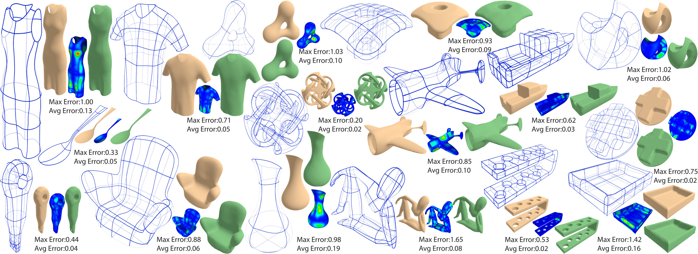

# FlowLoops: Robustly Extracting Descriptive Curve Networks from Standard Triangle Meshes
Edward Su, Nico Pietroni, Nicholas Vining, Alla Sheffer <br/>
*SIGGRAPH ASIA 2026* <br/>



## Abstract
Sparse, descriptive networks of 3D curves can efficiently represent complex free-form shapes, and serve as both a useful design tool and a powerful compact shape representation. Despite their utility, extracting these descriptive curve networks from shapes described using standard representations such as triangular meshes remains a challenging and open problem. Previous approach for generating such networks required well-behaved, spiral-free, curvature-aligned, quad-dominant meshes as inputs, but these meshes are themselves challenging to generate reliably. We present FlowLoops, an algorithm for extracting descriptive, compact 3D curve networks from general triangular meshes.

We observe that descriptive curves are expected to align with the curvature field in anisotropic surface areas and smoothly extend into isotropic areas following approximately geodesic directions, and that the descriptiveness of a given curve network can be explicitly evaluated by using it to reconstruct a surface and measuring the difference between the reconstructed and input surfaces. We consequently cast the problem of extracting a descriptive curve network as one of tracing a minimal set of field-aligned curves across a smooth, curvature-aligned, branched covering of the surface. When placing the curves we achieve sparsity by maximizing the spacing between them while ensuring accurate reconstruction. We validate our approach by extracting descriptive curve networks from a wide range of challenging inputs, and demonstrate that our method produces curve networks that accurately reproduce the original input surface. We further compare our results against potential alternative demonstrating their generality and superior descriptive power.

**BibTex**
```
To be added
```

### Summary
This repository is the official repository of the paper *FlowLoops: Robustly Extracting Descriptive Curve Networks from Standard Triangle Meshes*. <br>
Currently this page is under development and changes addressing missing areas will be added sortly.

### Data
The output curve networks and surfaced meshes as well as input meshes of the method can be found in the data folder. 

### Download
To be added

### Build
To be added

In case you have technical issues with the project, please raise an issue on GitHub